

# User Guide

Welcome. This guide walks you through the website with pictures, one action at a time. Skip to the section that matches how you use the site:

- [Signing in](#signing-in) — everyone
- [Students](#students) — see your courses, read PDFs, view announcements
- [Teachers](#teachers) — add sections and resources to your courses
- [Admins](#admins) — manage users, courses, banner, announcements

At the end there's a [screenshot checklist](#screenshot-checklist) — the shots you (or whoever is assembling this guide) need to take so every image below shows up.

---

## Signing in

1. Open the website in your browser.
2. Type your **Username** and **Password**.
3. Click **Sign in**.

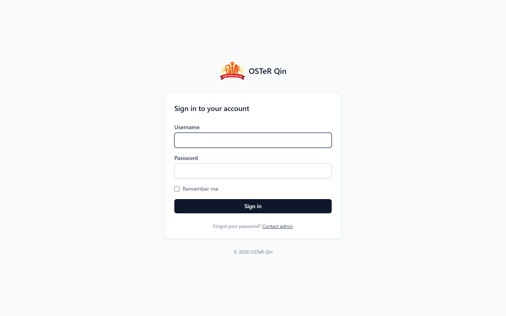

Forgot your password? Ask your administrator to reset it.

---

## The main screen

After signing in you see three areas:

- **Top bar** — logo on the left, your initials on the right
- **Sidebar** on the left — the menu
- **Main area** in the middle — the page you're looking at

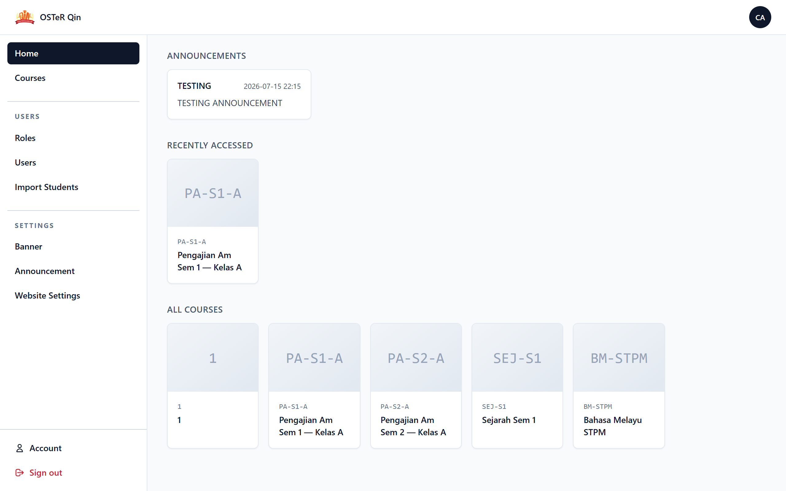

**Your initials** (top right) — click to open a small menu with **Account** and **Sign out**.

**Sidebar → Account** — click to change your password.

**Sidebar → Sign out** — the red button at the bottom of the sidebar.

---

## Students

### Home page

Home has three parts, stacked from top to bottom:

1. **Announcements** — cards for anything the centre sent you.
2. **Recently accessed** — up to 6 courses you opened lately.
3. **All courses** — every course you're enrolled in.

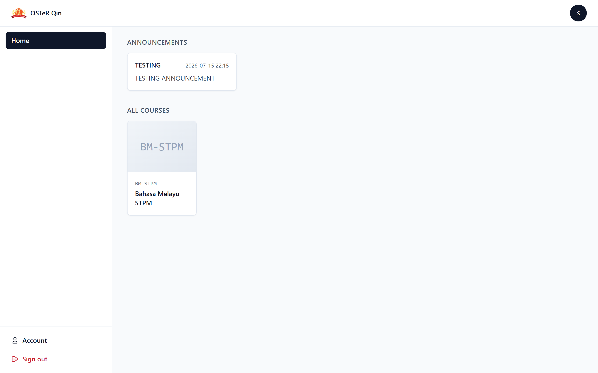

Click any card to open the course.

### Reading announcements

Announcements from your centre appear as cards at the top of the Home page. They stay visible for the whole window the admin scheduled (start / end dates).

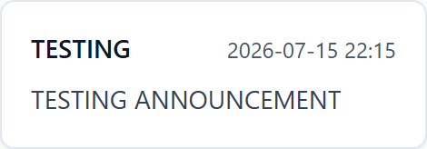

### Opening a course

Click a course card. You'll see the course page with **sections**. Each section is a labelled group of items.

Items can be:

- **PDF** — a downloadable file (opens in a viewer, see below)
- **Link** — opens a website in a new tab
- **Video** — opens a video (Google Drive / YouTube) in a new tab
- **Text** — a paragraph the teacher wrote, shown right there
- **Countdown** — a live timer counting down to a date

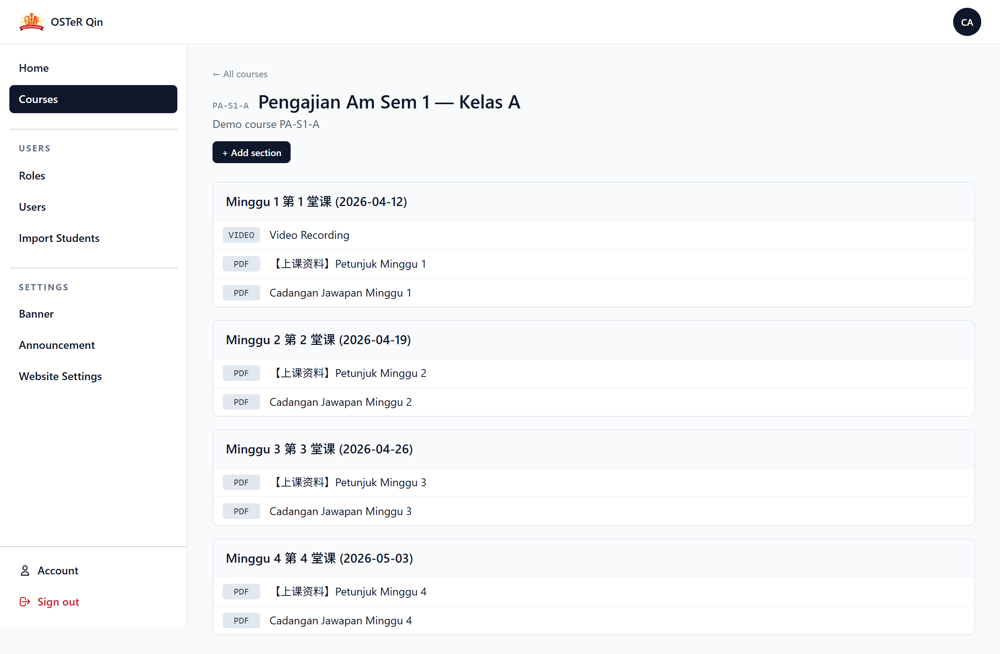

### Reading a PDF

1. Click a PDF item.
2. The **PDF viewer** opens with the file shown inside the page.
3. Use your browser's zoom, search, or print inside the viewer.
4. Click **Download** in the top right to save the file to your device.

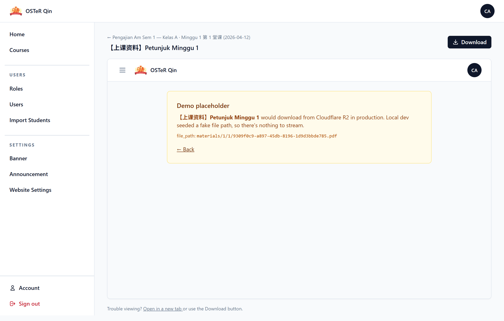

---

## Teachers

Teachers can do everything students can, plus add and edit content for the courses they've been assigned to.

### Finding your courses

Click **Courses** in the sidebar (or click any course card on Home).

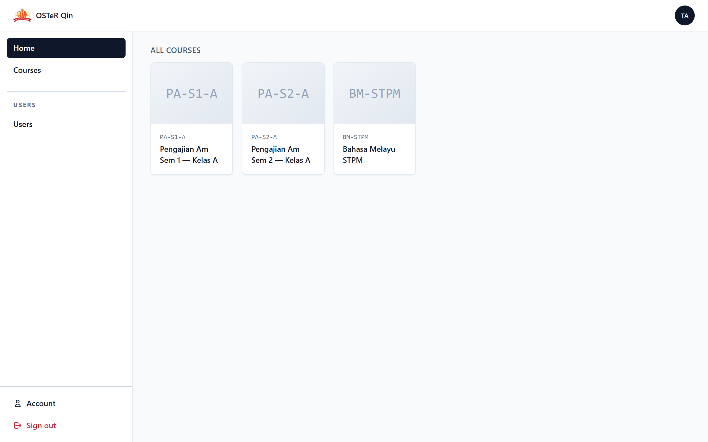

Click the course you want to work with — it opens straight to the course page.

### Editing a course

On the course page, click **+ Add section** (top of the page). You'll land on the course editor with the **Sections** tab open.

Tabs are along the top. **Sections** is where you add and change content.

### Adding a new section

Click **+ Insert section here** — a blank "Untitled section" appears straight away.

### Renaming a section (and other settings)

Click the green **Edit** button on the section card. A window opens. Change the:

- **Title** — what the section is called
- **Available from** (optional) — hide the section until this date/time
- **Sort order** — where it sits on the page (smaller number = higher)
- **Published** — tick to show it to students now

Click **Save changes**.

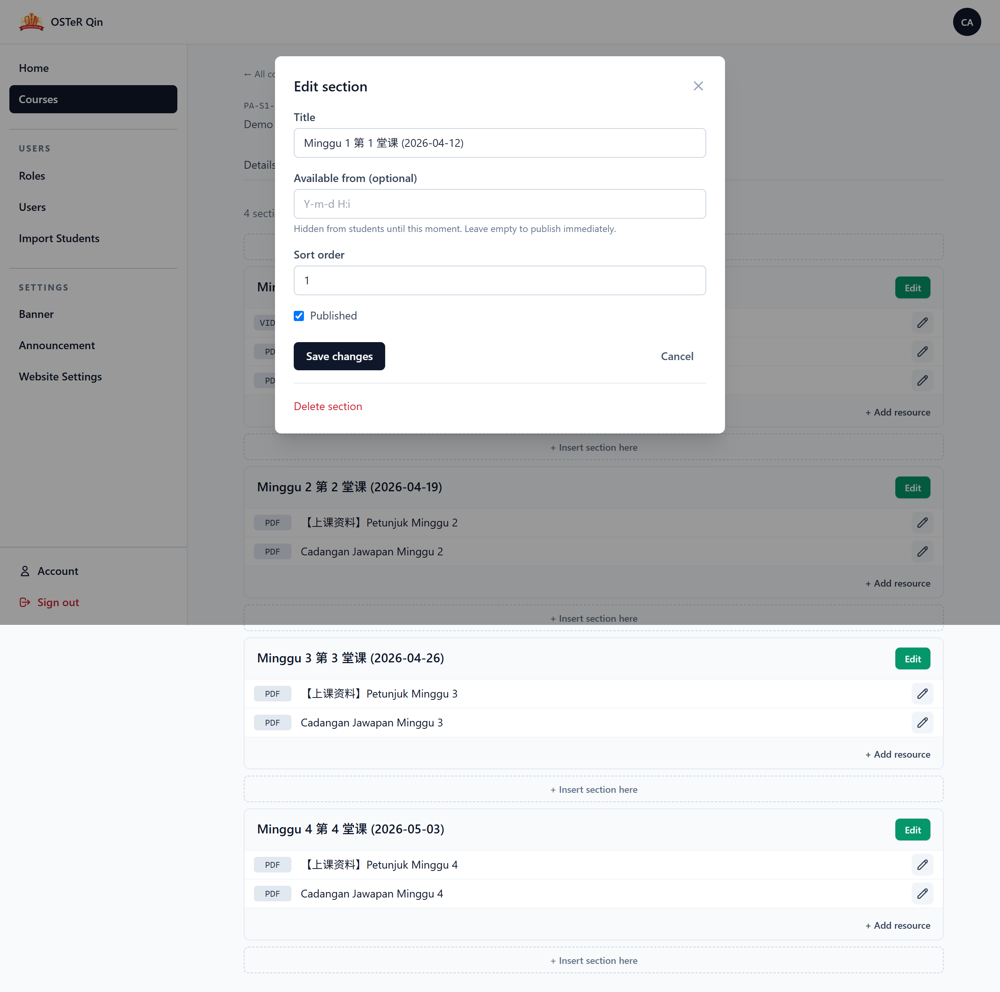

### Adding a resource

At the bottom of a section, click **+ Add resource**.

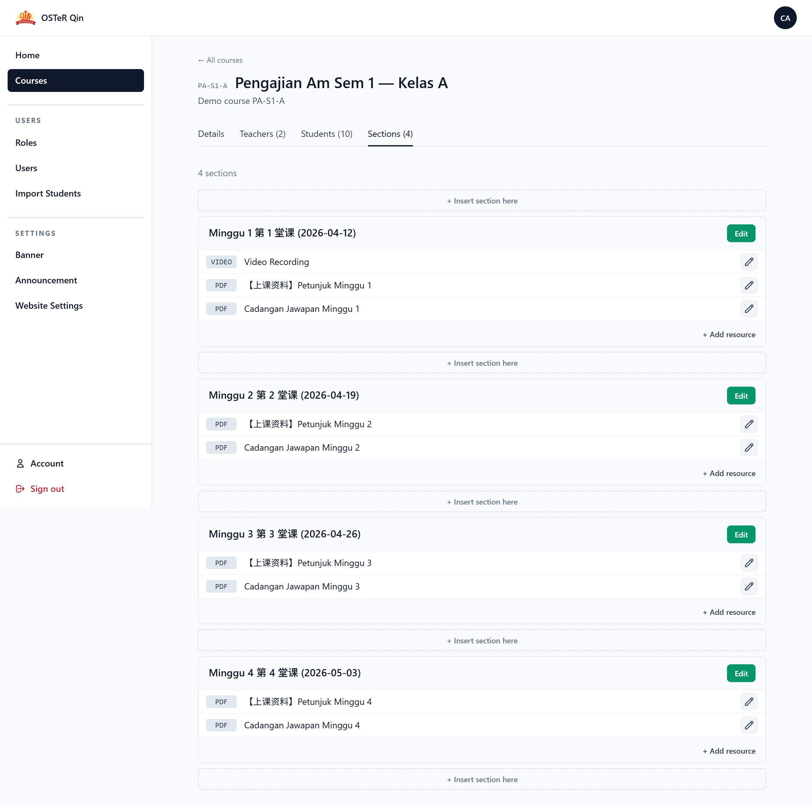

You'll see the resource form. Fill in:

1. **Title** — what students will see
2. **Type** — pick one of PDF / External link / Video link / Text block / Countdown timer
3. **The extra field** for that type (see below)
4. **Sort order** and **Published** as needed
5. Click **Add resource**

You go back to the course page, where the new item now appears in the section.

### The five resource types

#### PDF

Pick a file from your computer. Anything up to 50 MB.

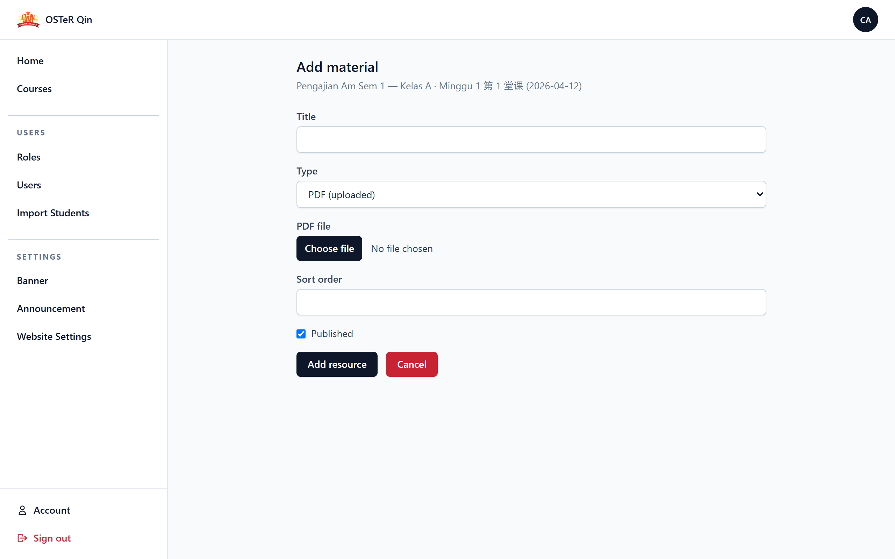

#### External link

Type the full URL. Opens in a new tab for students.

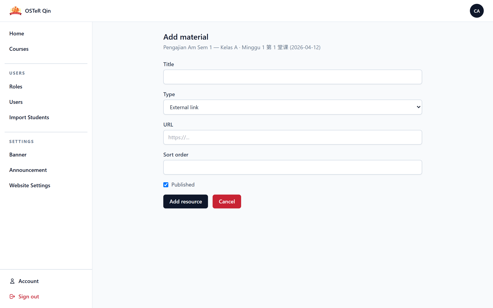

#### Video link

Same as external link. Paste a Google Drive share URL or a YouTube URL.

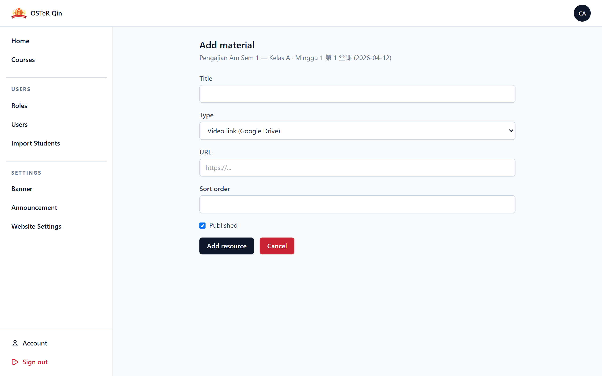

#### Text block

Write formatted text right in the browser. Use the toolbar for:

- **Heading** size (H1 / H2 / H3 / Normal)
- **Bold, italic, underline, strike-through**
- **Bullet or numbered lists**
- **Alignment** (left / center / right / justify)
- **Quote block**
- **Link** — highlight some text, click the link button, paste a URL
- **Image** — click the image icon, pick a picture, and it goes into your text

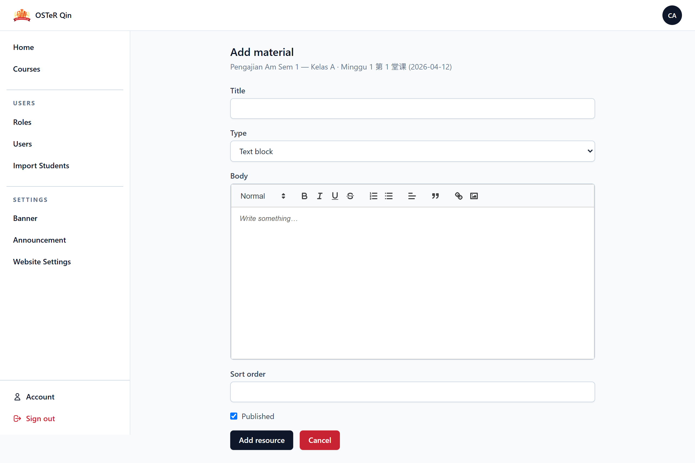

#### Countdown timer

Pick a date and time in the future. Students see a live clock ticking down.

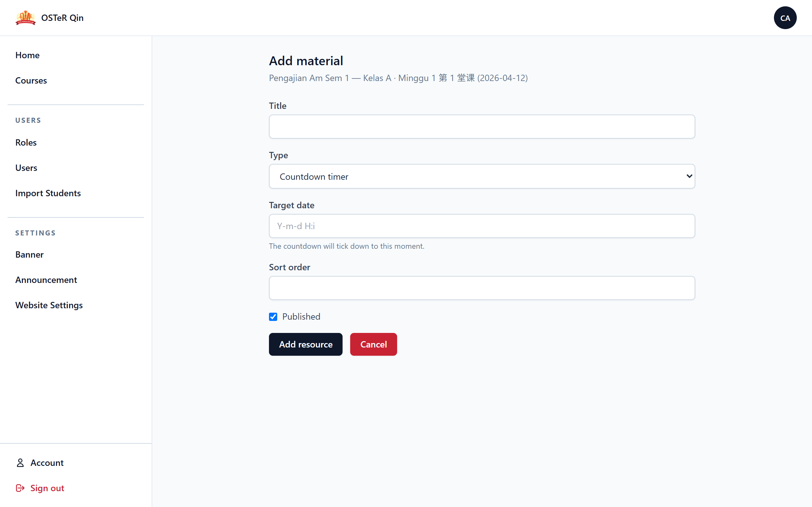

### Editing an existing resource

On the course edit page, hover the resource row. A small **pencil** icon appears on the right — click it.

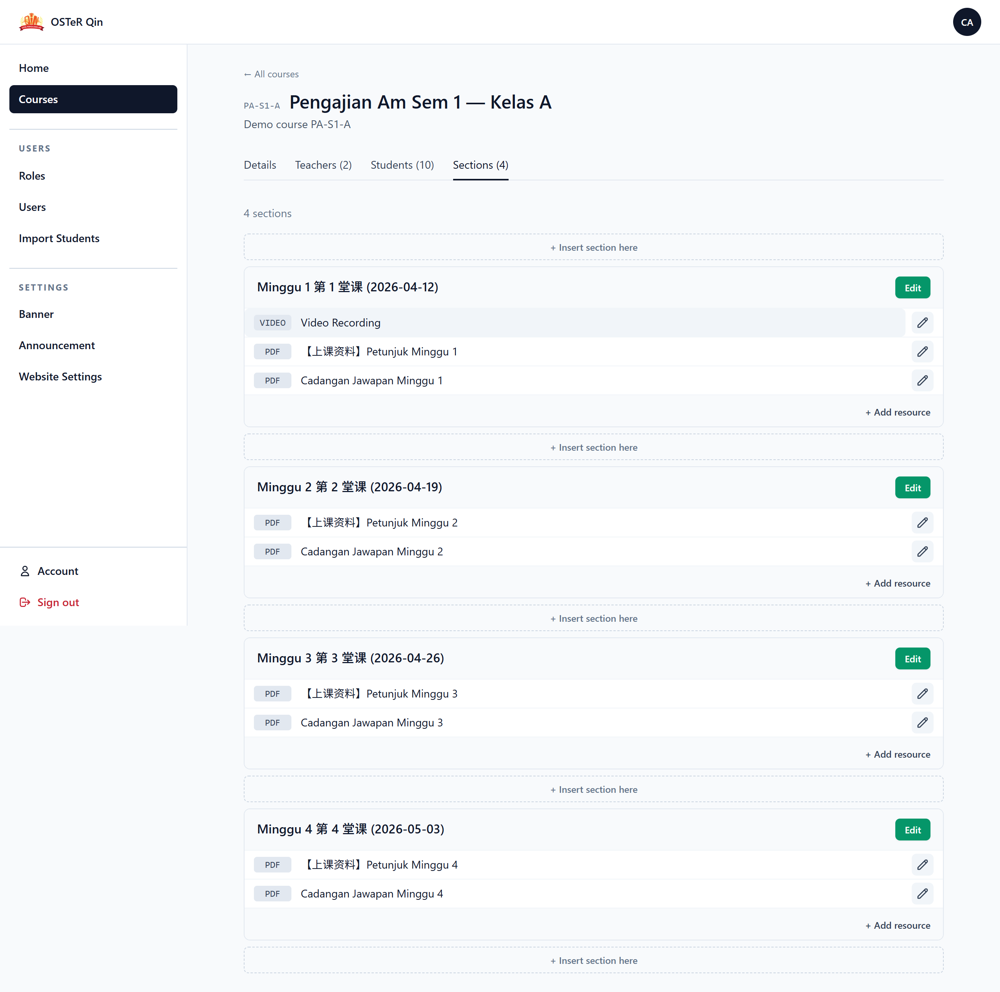

A window opens with the same fields as the create form. Change what you need, click **Save changes**.

To remove a resource, click the red **Delete material** button at the bottom of the same window.

### When students see a section

- **Published** ticked, no schedule → visible immediately.
- **Available from** set → visible only from that moment (published or not).
- Neither ticked → draft, hidden from students.

---

## Admins

Admins can do everything above plus manage users, roles, banner, announcements, and website settings.

### Adding a user (one at a time)

1. Sidebar → **Users** → **Users**.
2. Click the black **+ New user** button in the top right.

3. Fill in:
   - **Username** — must be unique
   - **Name**
   - **Phone** (optional)
   - **IC Number** (optional) — the person's IC number
   - **Candidate Number** (optional) — exam registration number (angka giliran)
   - **Role** — pick from the dropdown (admin role isn't offered here)
   - **Password** twice
4. Click **Create user**.

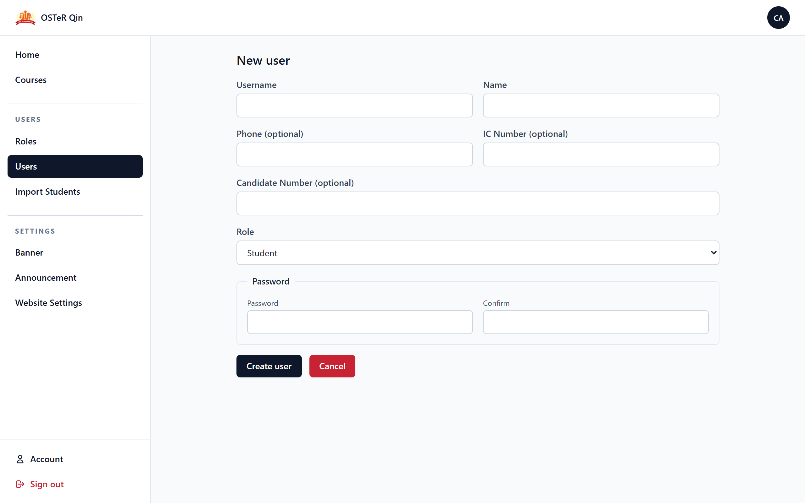

### Editing a user

From the Users page, click the green **Edit** button on the row. Change fields, click **Save changes**. Leave the password blank to keep the current one.

### Filtering and exporting the user list

At the top of the Users page:

- Type in the search box to filter by username or name.
- Pick a **Role** or **Course** to narrow down.
- Set **Active** / **Inactive**.

Click the green **Export Excel** button to download the current filtered list as a spreadsheet.

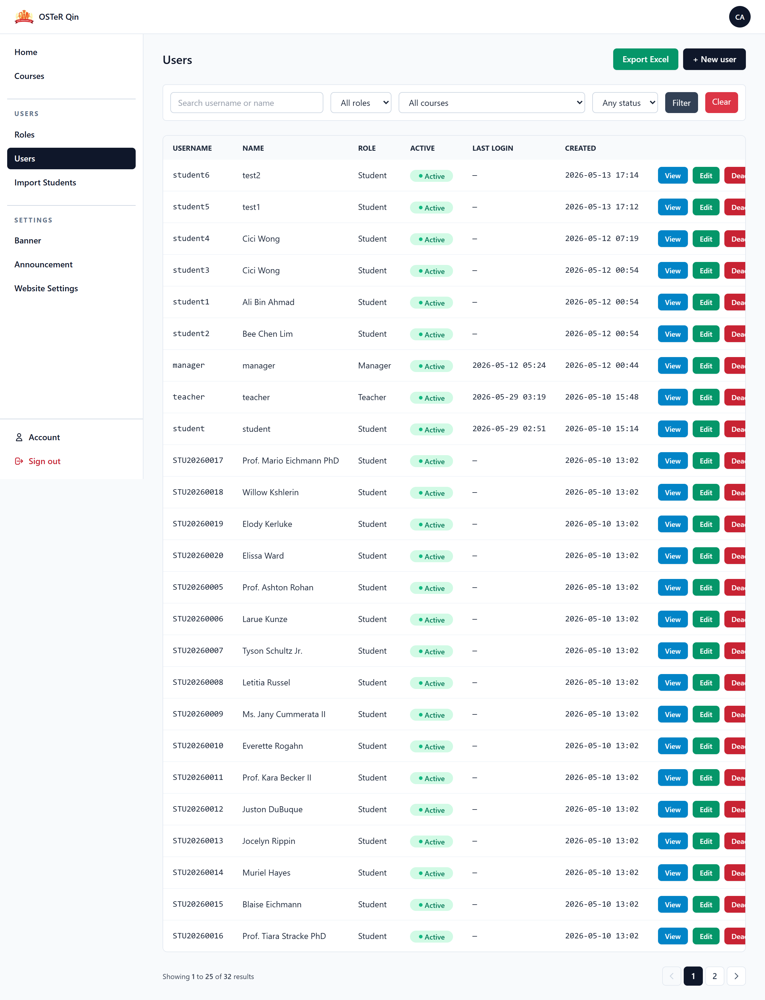

### Importing many students at once

1. Sidebar → **Users** → **Import Students**.
2. Click **Download sample Excel** — you'll get a spreadsheet with the right column headings.
3. Open it, fill in one row per student. Only the **name** column is required.
4. Save the file.
5. Back on the import page, click **Choose file** and pick your Excel/CSV.

The preview appears automatically after you pick the file.

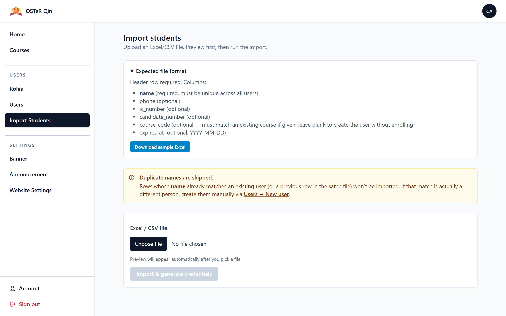

6. Check the numbers on top: **OK** / **Skipped** / **Errors**. Read the tables underneath to see why any rows were skipped.
7. When you're happy, click **Import & generate credentials**.
8. A credentials spreadsheet downloads automatically. Keep it safe — that's the only time the passwords are shown to you in plain form.

**About duplicate names**: rows with a name that already exists (or that appears earlier in the same file) are always skipped. If the match is actually a different person, create them manually via **Users → New user**.

### Roles

Sidebar → **Users** → **Roles**.

Roles are named permission sets. A user can have one role.

- **System roles** (`admin`, `student`, `teacher`) can be edited but not deleted.
- **Custom roles** — click **+ New role** to make one.

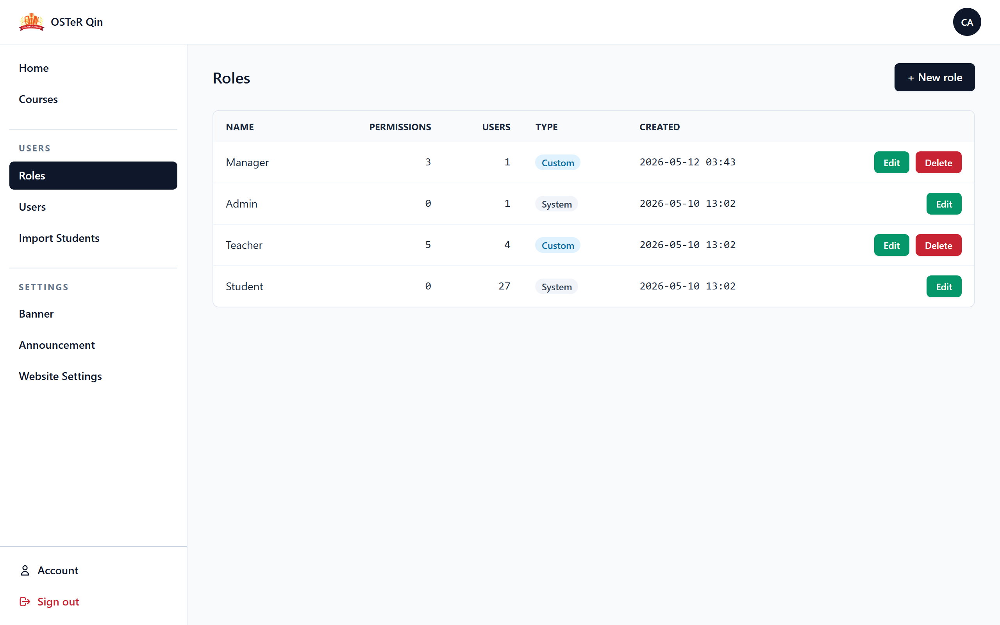

In the role form, type a name and tick the permissions you want the role to have. Save.

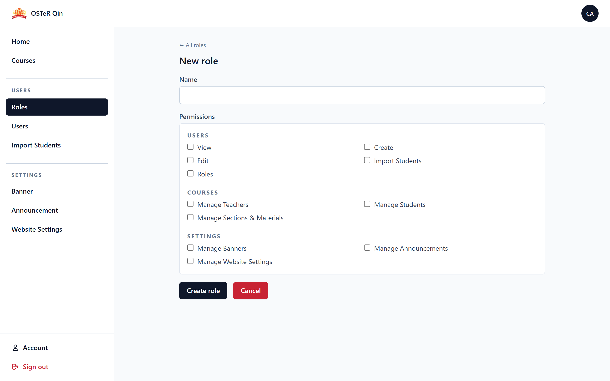

### Courses

Sidebar → **Courses**.

- **+ New course** (top right, admins only) — creates a course with a code, name, description, and optional banner image.
- **Edit** on each row — takes you to the same tabbed edit page teachers see.
- **Deactivate / Activate** — hides the course from students without deleting it.

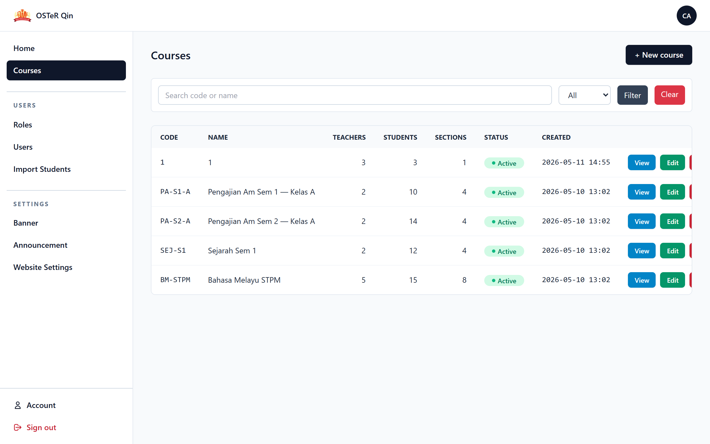

The **Details** tab (admins only) is where you change the course code, name, description, and banner image.

The **Teachers** tab (admins) — assign staff.

The **Students** tab — enroll or remove students.

### Banner

Sidebar → **Settings** → **Banner**.

These are the images that appear on the public homepage (before people log in).

1. Click **+ Upload**.
2. Pick an image, fill in the title and subtitle.
3. Set a link URL if you want the image to be clickable.
4. Set **Sort order** and tick **Active**.
5. Click **Save**.

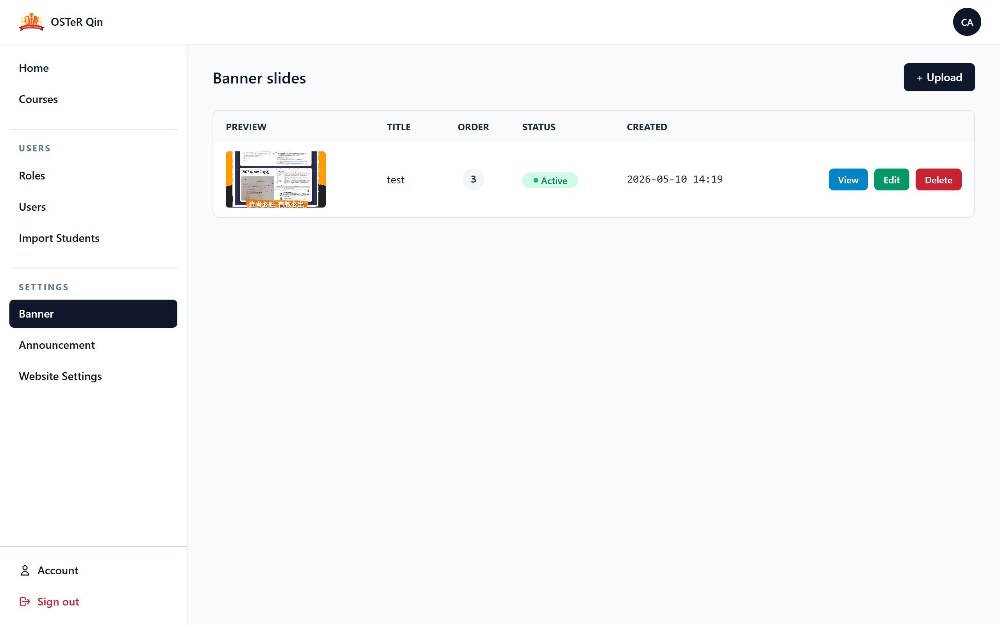

### Sending an announcement

Sidebar → **Settings** → **Announcement**.

1. Click **+ Send announcement**.
2. Fill in **Title**, **Body** (the message text), and pick the audience:
   - **Everyone**
   - **All students**
   - **All teachers**
3. Optionally restrict to a specific course via the **Course** dropdown.
4. Pick **Starts at** and **Ends at** — the announcement only shows in this window.
5. Click **Send**.

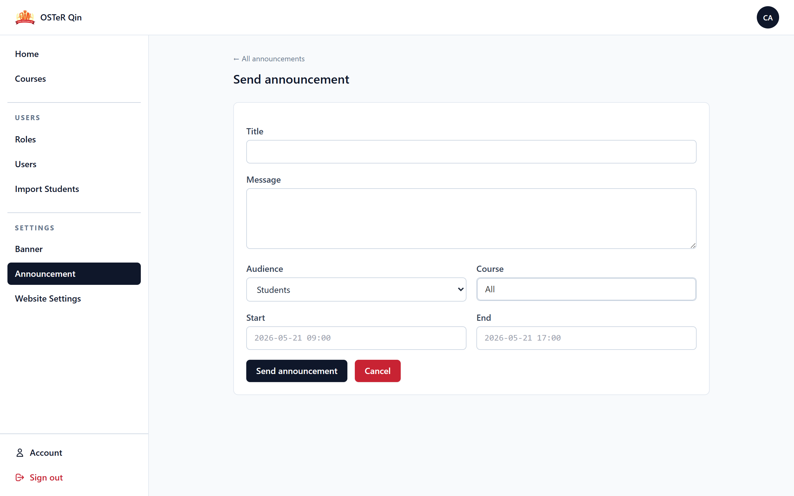

The announcement appears at the top of every recipient's Home page. **Admins always get a copy**, so you'll see yours on your own Home too.

### Website settings

Sidebar → **Settings** → **Website Settings**.

Change site-wide stuff:

- **Centre name** — appears in the browser tab title and on the public homepage
- **Centre description** — used for search engines
- **Logo** — used as the tab icon and in the top bar

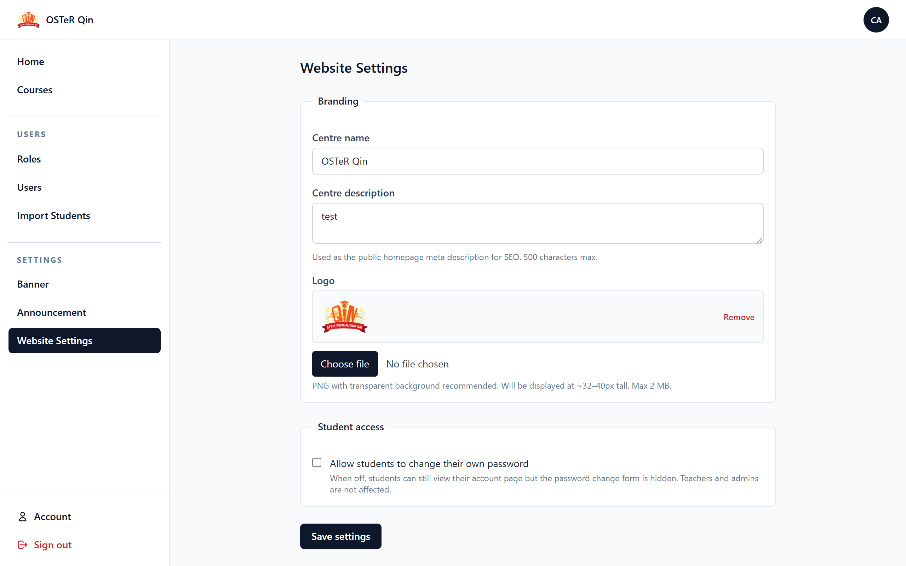

---

## Need help?

Ask your administrator. Bugs and feature requests → same place.
